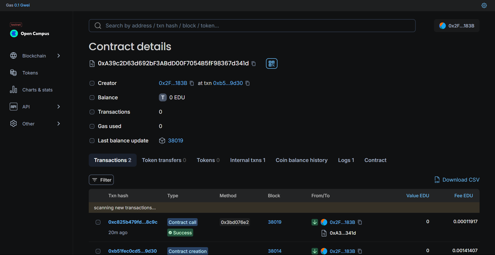

# TokenizedStockBuying Smart Contract

## Overview

The `TokenizedStockBuying` smart contract is a Solidity-based smart contract for managing the buying and selling of stocks on the Ethereum blockchain. It allows users to buy stocks, mark them as sold, and view stock details and all stocks owned by a user.

## Contract Features

- **Buy Stocks**: Users can purchase stocks by specifying the stock name, quantity, price, and mobile number.
- **Sell Stocks**: Users can mark their stocks as sold.
- **Get Stock Details**: Retrieve details of a specific stock purchase.
- **Get User Stocks**: Retrieve all stocks purchased by a specific user.

## Contract Structure

### `Buyer` Struct

The `Buyer` struct represents details about a stock purchase:
- `bytes32 buyerID`: Unique identifier for the stock purchase.
- `uint256 price`: Price of the stock at the time of purchase.
- `uint256 quantity`: Quantity of the stock purchased.
- `string stock`: Name of the stock.
- `bool sold`: Indicates whether the stock has been sold.
- `uint256 mobileNumber`: Mobile number associated with the purchase.

### State Variables

- `uint256 public buyerCounter`: Counter used to generate unique buyer IDs.
- `mapping(bytes32 => Buyer) public buyers`: Maps `buyerID` to `Buyer` details.
- `mapping(address => bytes32[]) public userStocks`: Maps user addresses to arrays of `buyerID`s.

### Events

- `event StockBought(bytes32 buyerID, address buyerAddress, string stock, uint256 quantity, uint256 price)`: Emitted when a stock is purchased.
- `event StockSold(bytes32 buyerID, address buyerAddress, string stock, uint256 quantity)`: Emitted when a stock is sold.

### Functions

- **`buyStock(string memory _stock, uint256 _quantity, uint256 _price, uint256 _mobileNumber) public returns (bytes32)`**:
  Allows users to buy a stock and returns a unique `buyerID`.

- **`sellStock(bytes32 _buyerID) public`**:
  Allows users to mark a stock as sold using the `buyerID`.

- **`getStockDetails(bytes32 _buyerID) public view returns (Buyer memory)`**:
  Retrieves details of a specific stock purchase using the `buyerID`.

- **`getUserStocks(address _user) public view returns (Buyer[] memory)`**:
  Retrieves all stocks purchased by a specific user.

## Usage

1. **Buying Stocks**:
   Call the `buyStock` function with the stock name, quantity, price, and mobile number. This will generate a unique `buyerID` and store the purchase details.

2. **Selling Stocks**:
   Call the `sellStock` function with the `buyerID` of the stock you want to mark as sold.

3. **Getting Stock Details**:
   Call the `getStockDetails` function with the `buyerID` to get details of a specific stock purchase.

4. **Getting User Stocks**:
   Call the `getUserStocks` function with the user's address to get all stocks purchased by that user.

## Security Considerations

- **Ensure Unique IDs**: The contract uses a combination of `block.timestamp`, `msg.sender`, and a counter to generate unique `buyerID`s. This method helps avoid collisions but should be reviewed for security.
- **Access Control**: Consider implementing additional access control mechanisms to restrict who can buy or sell stocks.

## Developer Details

Name Shubh sahu
Email : shubhxtech@gmail.com
Github UserName : shubhxtech

## Deployment Details
Chain : EduChain
Contract Id : 0x9eb484d3278c0b3329b13ab4c966c2e80bf3e6c3

